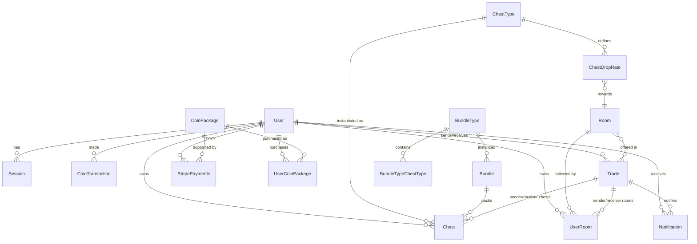

# Database Model Overview

The backend leverages **Prisma ORM** to define & migrate the PostgreSQL schema. Below is a condensed explanation of the key entities and their relationships. For the authoritative source, inspect `prisma/schema.prisma`.

---

## ER Diagram (simplified)

---

## Tables & Important Fields

### User

- `id` — Primary key (cuid)
- `username`, `email`, `password`
- `coinBalance` — In-game currency
- `xp` — Player experience points
- Relations: sessions, achievements, chests, rooms, trades, notifications

### ChestType & Chest

- **ChestType**: metadata (price, xpGain, rarity drop rates, sprite URLs)
- **Chest**: concrete instance (`opened` flag) owned by a user

### Room & UserRoom

- **Room**: Master record (name, rarity, category, `assetUrl`)
- **UserRoom**: Junction of user & room, includes timestamps

### BundleType / Bundle

- BundleType: SKU sold for real money – defines coin amount & chest assortment
- Bundle: Owned copy linked to purchasing user & potential Stripe payment

### CoinPackage / UserCoinPackage

- Straight coin purchases – similar structure to bundles but coins-only

### Trade

- Holds senderId, receiverId + ready/confirm flags & `status`
- M-N relations to `Chest` and `UserRoom` for each side (via relation tables created by Prisma)

### Notification

- Generic alert mechanism typed by `NotificationType` enum
- Can reference chest, room, achievement or trade depending on event

### Achievements

- Static achievement records unlocked by users; many-to-many (users ↔ achievements)

### StripePayments & StripeEvents

- Records lifecycle of Stripe checkout / payment intent
- Child `StripeEvents` store raw webhook payload IDs

---

## Enums

- **Rarity**: UNCOMMON, COMMON, RARE, EPIC, LEGENDARY, SECRET
- **RoomCategory**: Thematic classification (ZEN, NEON, COSMIC, etc.)
- **NotificationType**: ROOM_RECEIVED, CHEST_RECEIVED, XP_GAIN, ...
- **TradeStatus**: PENDING / COMPLETED
- **CoinTransactionType**: PURCHASE / REWARD / GIFT / OPEN_CHEST
- **StripePaymentStatus**: COMPLETED / FAILED

---

> This overview omits some indexing & join details for brevity. Refer to the full Prisma schema for edge-cases and generated TypeScript types under `src/generated/prisma`.
